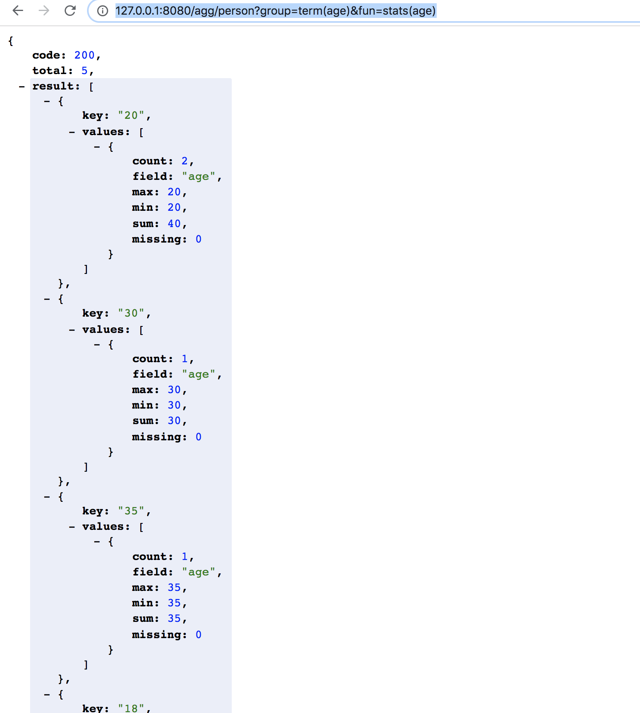
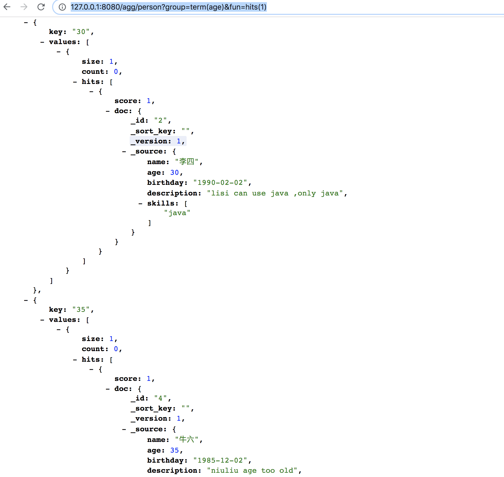
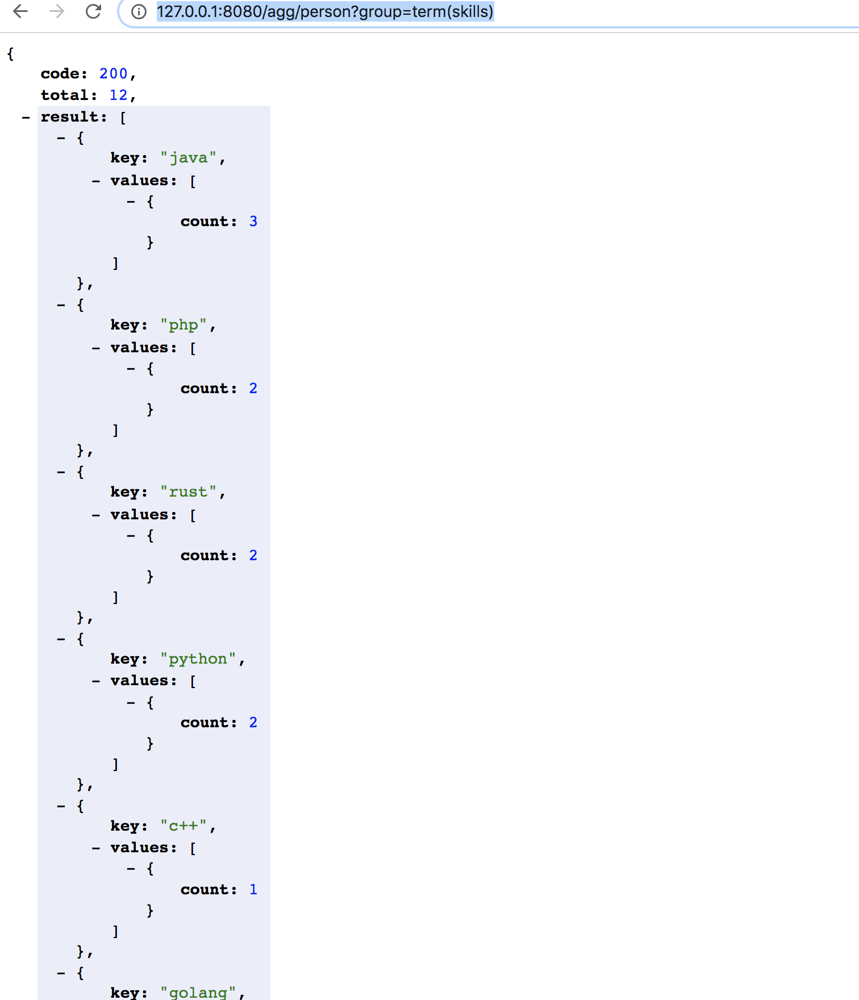

# 聚合那些事儿

下面我们来介绍一下chubaodb的聚合功能，在这之前，你确信已经通过[库表管理](*./collection.md*)创建了表。

我们先插入一些测试数据吧，先创建5个人

````
curl -H "Content-Type: application/json" -XPOST -d'
{
	"name": "张三",
	"age": 20,
	"birthday": "2000-02-02",
	"description": "zhangsan can use java good at php, but python not good at",
	"skills": ["java", "php", "python"]
}
' "http://127.0.0.1:8080/put/person/1"

curl -H "Content-Type: application/json" -XPOST -d'
{
	"name": "李四",
	"age": 30,
	"birthday": "1990-02-02",
	"description": "lisi can use java ,only java",
	"skills": ["java"]
}
' "http://127.0.0.1:8080/put/person/2"

curl -H "Content-Type: application/json" -XPOST -d'
{
	"name": "王五",
	"age": 20,
	"birthday": "2000-03-20",
	"description": "wangwu is c++ rust good at!",
	"skills": ["c++", "rust"]
}
' "http://127.0.0.1:8080/put/person/3"

curl -H "Content-Type: application/json" -XPOST -d'
{
	"name": "牛六",
	"age": 35,
	"birthday": "1985-12-02",
	"description": "niuliu age too old",
	"skills": ["java", "golang", "python", "rust"]
}
' "http://127.0.0.1:8080/put/person/4"

curl -H "Content-Type: application/json" -XPOST -d'
{
	"name": "赵七",
	"age": 18,
	"birthday": "2002-03-12",
	"description": "is a web user, he can use ruby and php",
	"skills": ["php", "ruby"]
}
' "http://127.0.0.1:8080/put/person/5"
````


插入完成后，我们通过search接口可以查看到这五个人 `http://127.0.0.1:8080/search/person`


我们先了解下聚合的真谛。 我们从一句大家都熟悉的sql 入手吧

`select age,count(age) from person group by age`

这个聚合函数可以堪称两个部分。分别是 `group by ` 分组，和 `count(*)` 指标连个部分。所以聚合份两种，一个是分组，一个和统计。

ok，现在让我们看看在`chubaodb`中这两部分是如何完成的。我们通过一个例子入手

`http://127.0.0.1:8080/agg/person?group=term(age)&fun=stats(age)`

* agg 是方法的操作
* group= 是聚合方法。例子中我们用的term 方式进行分组。
* fun = 是指标方法。例子中我们统计 max ，min 等




好的恭喜你已经看到结果了。默认是按照value中的count 进行排序


### 目前group 支持的方法有

`term(name)` 按照字段进行聚合

`date(name,format)` example: date(birthday, yyyy-MM) 按照时间格式进行聚合

`range(name, range_str)` example:*range(age,-0,0-20,20-30,30-40,40-)*


### Fun 支持的方法有

`hits(size)`:每个分组中返回size个文档，无排序功能

`stats(name)`: 每个分组中，count max, min , sum missing 的个数

* fun 可以为空，如果为空则默认为count方式


现在让我们自举一些例子：

### 按照年龄分组，分别显示每个年龄中的人

  

### 照技能分组，显示每个技能的人数

`http://127.0.0.1:8080/agg/person?group=term(skills)`



### 按照技能分组，显示每个技能的人数,按照技能名称排序

`http://127.0.0.1:8080/agg/person?group=term(skills)&sort=key:asc`


### 按照年龄和技能分组查看人数

