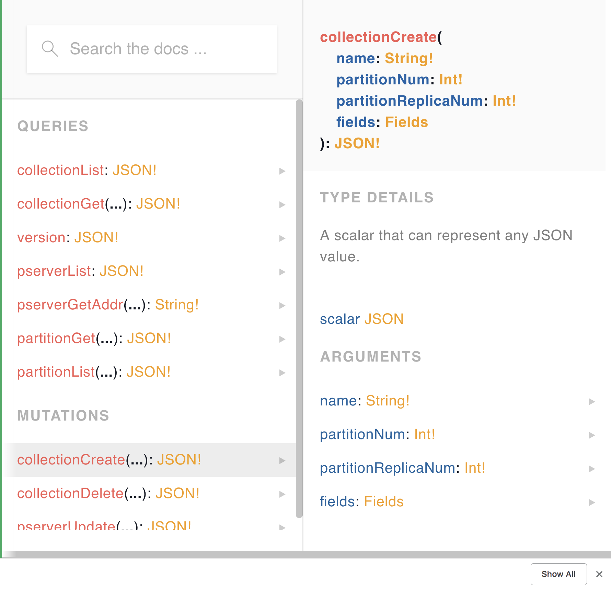
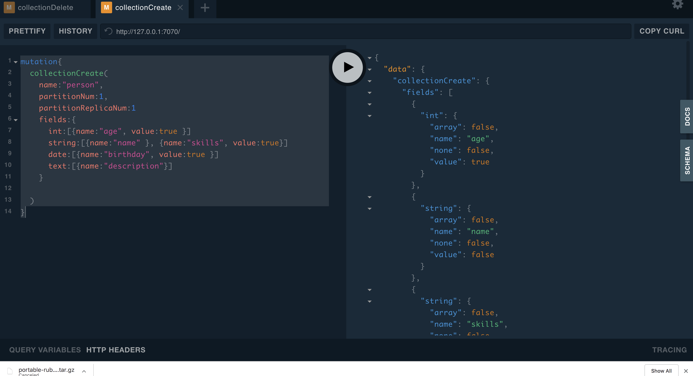
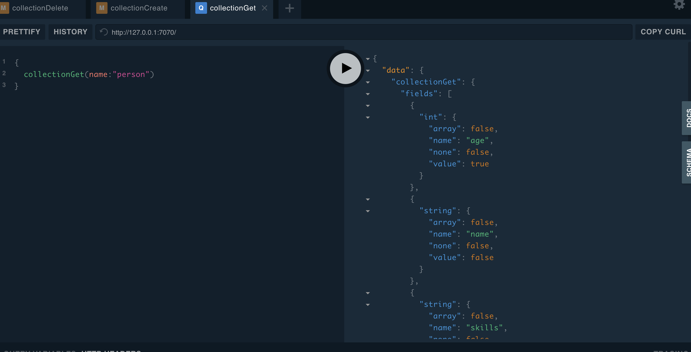

# 库表管理

下面我们会对`创建表`,`查询表`，`删除表` 进行演示。目前表结构一旦创建不支持修改。
打开master的管理地址 http://127.0.0.1:7070

### 创建表

通过 `collectionCreate`接口进行创建



* Name 是表名称， 
* partitionNum 是这个表分多少个分片。分片多会提高插入的并发能力，但是会降低搜索效率，并非越多或者越少越好
* partitionReplicaNum 是每个分片多少个副本。建议要么1，要么3+ 。在传统分布式系统环境，可以设置为3，单机版智能设置1.partitionReplicaNum 必须小于等于你的机器个数
* Fields 是这个表里面的字段。我们提供了 `int`, `float`, `string`, `text`, `vector`, `date` 几种字段格式，注意 text 和string的区别是。text是全文检索，比如 `中国银行` 搜索`中国`是会被召回的， `string`的话必须输入完整的 匹配。


下面我们创建一个人物表，包含 `ID`， `姓名`， `年龄` ，`生日` ， `简介` ，`技能` 几个字段，

````
mutation{
  collectionCreate(
    name:"person", 
    partitionNum:1, 
    partitionReplicaNum:1
  	fields:{
      int:[{name:"age", value:true }]
      string:[{name:"name" }, {name:"skills", value:true, array:true}]
      date:[{name:"birthday", value:true }]
      text:[{name:"description"}]
    }
  
  )
}
````




出现如下结构意味着创建表成功了。每种类型有自己的参数大家可以参阅iql的文档。


### 查询表




删除表


ok 你已经具备了元数据管理的基本技能。