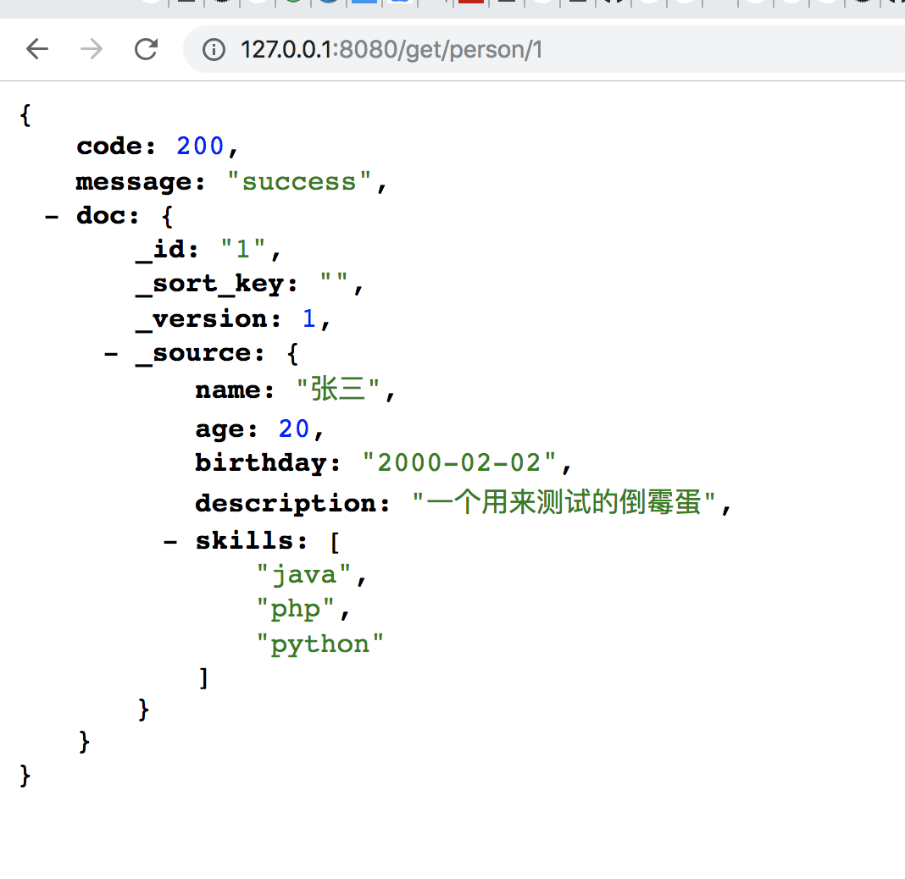
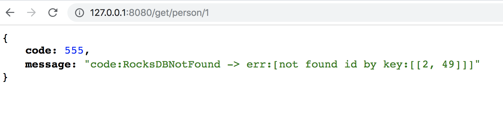

# crud那些事儿

在[库表管理](./collection.md)里我们学习了如何创建一个表。下面让我们对这个表进行数据的增删改查。

在这之前我们了解下插入数据的姿势。

* `put` 代表不管有没有都插进去。document的version归为1
* `create` 必须没有，如果有报错，document的version为1
* `update` 必须存在，如果不存在就报错， document的version 递增+1
* `upsert` 有则走`update`逻辑，没有则走`create`逻辑

好了你已经学会了存储的真谛，让我们来试着插入一条数据吧！注意数据操作是在 router 上进行，也就是默认的`8080`端口上。

## put

````
curl -H "Content-Type: application/json" -XPOST -d'
{
	"name": "张三",
	"age": 20,
	"birthday": "2000-02-02",
	"description": "一个用来测试的倒霉蛋",
	"skills": ["java", "php", "python"]
}
' "http://127.0.0.1:8080/put/person/1"
````
看到如下


代表插入成功！

* `http://127.0.0.1:8080/put/person/1` 地址中`person` 是我们创建的表名称， 1 位当前用户的唯一id。字符串格式。（ps:id 还有一种方式，双keyid。这是一种很高级的做法，后门我们会对次情况单门一章来说明）

我们可以通过get 接口来获取这条数据 http://127.0.0.1:8080/get/person/1




## update

比如我们尝试更新张三的技能增加rust 通过如下方式

````
curl -H "Content-Type: application/json" -XPOST -d'
{
	"skills": ["java", "php", "python","rust"]
}
' "http://127.0.0.1:8080/update/person/1"
````


我们可以开心的看到张三学会了`rust` 并且 version 改为了2.


## delete

通过 

```
curl -XDELETE http://127.0.0.1:8080/delete/person/1
{"code":200,"message":"success"}
```

可以删除张三这条记录。我们看看删除后再做get会得到什么



嗯。很好本章结束了！