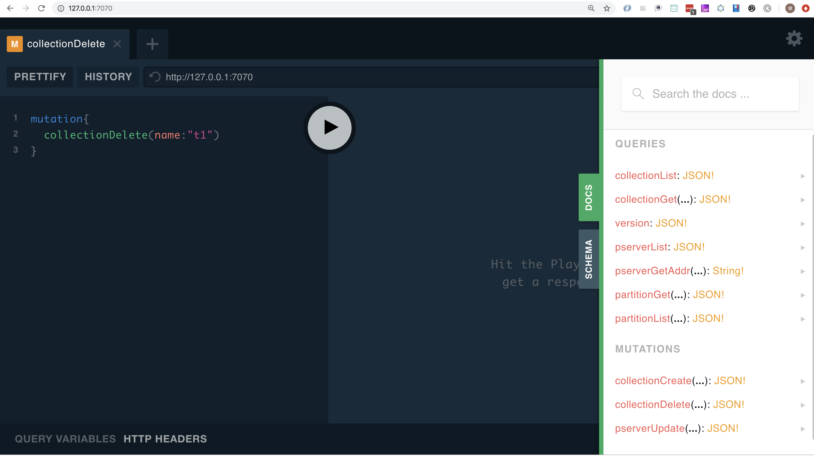

# 元数据管理

元数据管理是在master api上，提供了graphql的方式。同时内置了一个iql。如果你没有对配置做过更改，master 的地址应该为 http://127.0.0.1:7070

打开地址你就看到如下




熟悉iql的就不解释了，不熟悉的用用就差不多。


我们简单说一下各个接口的功能，以collectionGet 为例，这个接口是获取一个表的结构， 点击右侧第二个方法。可以看到需要的参数


参数为，id ，name 。类型后门没有跟`!`意思就非必须字段。但是必须二选一。意味着你可以通过一个name 或者id 去查询这个collection.然后我们输入query

````
{
  collectionGet(name:"t1")
}
````


可以看到报错了。没错。就是错了。因为我没还没有创建名字为`t1`的collection。后门会有创建的方式。那我们换一个简单的的吧。我们通过query来查询当前系统的版本。


红色部分为返回结果。太过简单就不解释了。