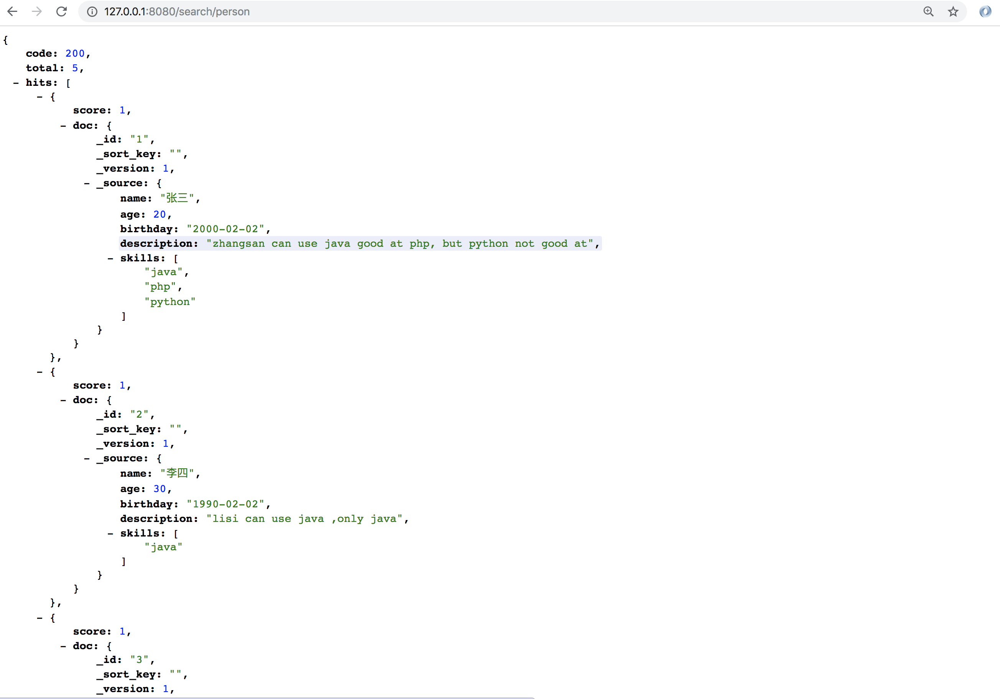
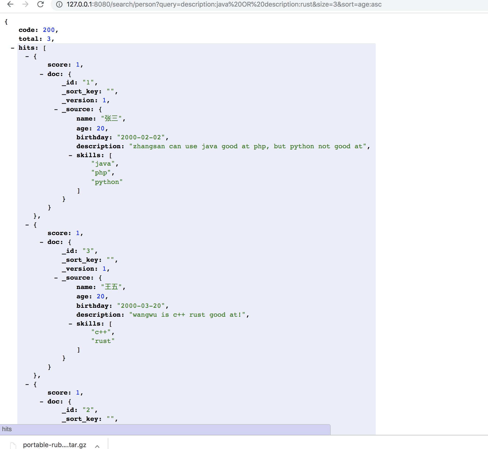
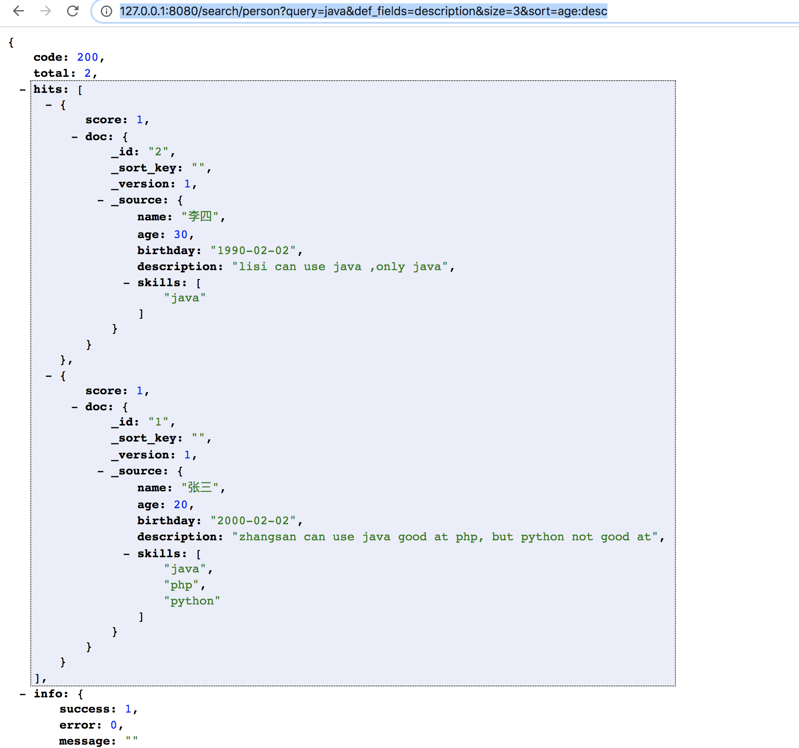

# 搜索那些事儿

下面我们来介绍一下chubaodb的搜索功能，在这之前，你确信已经通过[库表管理](*./collection.md*)创建了表。

我们先插入一些测试数据吧，先创建5个人

````
curl -H "Content-Type: application/json" -XPOST -d'
{
	"name": "张三",
	"age": 20,
	"birthday": "2000-02-02",
	"description": "zhangsan can use java good at php, but python not good at",
	"skills": ["java", "php", "python"]
}
' "http://127.0.0.1:8080/put/person/1"

curl -H "Content-Type: application/json" -XPOST -d'
{
	"name": "李四",
	"age": 30,
	"birthday": "1990-02-02",
	"description": "lisi can use java ,only java",
	"skills": ["java"]
}
' "http://127.0.0.1:8080/put/person/2"

curl -H "Content-Type: application/json" -XPOST -d'
{
	"name": "王五",
	"age": 20,
	"birthday": "2000-03-20",
	"description": "wangwu is c++ rust good at!",
	"skills": ["c++", "rust"]
}
' "http://127.0.0.1:8080/put/person/3"

curl -H "Content-Type: application/json" -XPOST -d'
{
	"name": "牛六",
	"age": 35,
	"birthday": "1985-12-02",
	"description": "niuliu age too old",
	"skills": ["java", "golang", "python", "rust"]
}
' "http://127.0.0.1:8080/put/person/4"

curl -H "Content-Type: application/json" -XPOST -d'
{
	"name": "赵七",
	"age": 18,
	"birthday": "2002-03-12",
	"description": "is a web user, he can use ruby and php",
	"skills": ["php", "ruby"]
}
' "http://127.0.0.1:8080/put/person/5"
````


插入完成后，我们通过search接口可以查看到这五个人 `http://127.0.0.1:8080/search/person`





http://127.0.0.1:8080/search/person` 参数为空时语义为query:* search 又如下参数

*  query 查询语句，也就是类似lucene 的dsl 。（TODO： 专门一章介绍dsl）
*  def_fields 默认查询字段。当query不指定字段时候以此字段为查询，为or的关系，可以多个字段用逗号`,`隔开
*  size: 返回数据条数，默认为20
*  sort: 排序规则 example：*name:asc|age:desc* , 默认为score排序也就是相关度

下面我们把这些query 都用上做一个查询吧！

`http://127.0.0.1:8080/search/person?query=name:%E5%BC%A0%E4%B8%89&size=3&sort=age:asc`


下面让我们自举一些需求。

查找摘要中 包含 rust 或者 java 的人 

* `http://127.0.0.1:8080/search/person?query=description:java%20OR%20description:rust&size=3&sort=age:asc`
* 上述语句等同于 `http://127.0.0.1:8080/search/person?query=java%20OR%20rust&def_fields=description&size=3&sort=age:asc`





查找摘要中 包含  java 的人  按照年龄倒序

````
http://127.0.0.1:8080/search/person?query=java&def_fields=description&size=3&sort=age:desc
````




### 精确查找

在用户名或者摘要中查找 `web user` 为关键字的用户。

